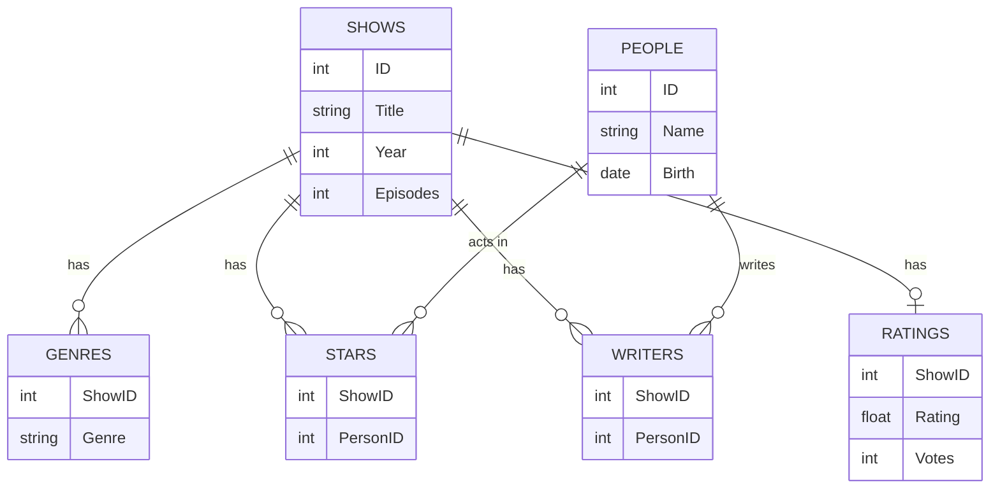

# TV Show Database Design

```mermaid
erDiagram
    SHOWS {
        int ID
        string Title
        int Year
        int Episodes
    }
    PEOPLE {
        int ID
        string Name
        date Birth
    }
    GENRES {
        int ShowID
        string Genre
    }
    STARS {
        int ShowID
        int PersonID
    }
    WRITERS {
        int ShowID
        int PersonID
    }
    RATINGS {
        int ShowID
        float Rating
        int Votes
    }

    SHOWS ||--o{ GENRES : "has"
    SHOWS ||--o{ STARS : "has"
    PEOPLE ||--o{ STARS : "acts in"
    SHOWS ||--o{ WRITERS : "has"
    PEOPLE ||--o{ WRITERS : "writes"
    SHOWS ||--o| RATINGS : "has"
```
